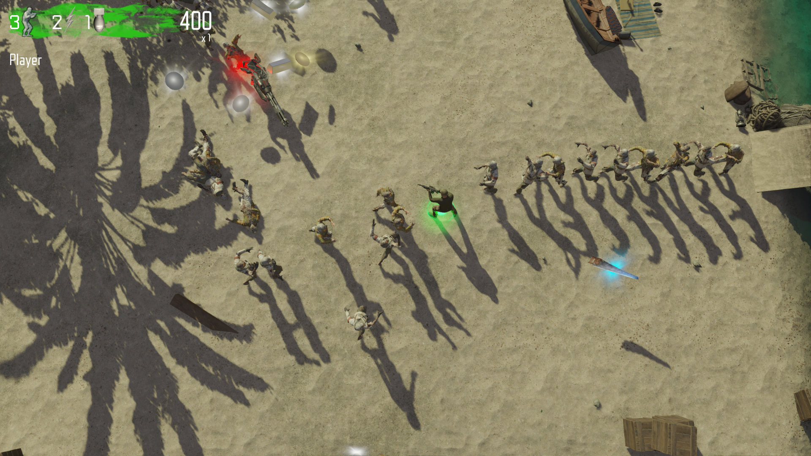
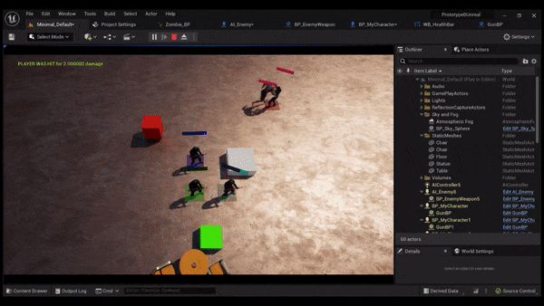

//ctrl + shift + v to view MD from vscode

### Top Down Shooter

I took alot of inspiration from dead ops arcade 2 when looking at fps mechanics. 
In dead ops arcade it feels like they use raycast shooting, and upon research I found all the call of duty games use hitscan for most weapons, aside from rockets or snipers which use projectiles as they can be slower and or have bullet drop.
I also played and looked at a game like fortnite which is not top down but is a shooter made in unreal engine, and I found similar information about the shooting mechanics. 

## Tuesday 25th, September 2023 - Basic Hitscan stuff

My hitscan system
* when player holds the shoot button
* start a looping timer, that repeats every X seconds (x = fire rate)
* every time the timer completes, cast a ray
* if the ray hits an enemy actor, call that actors TakeDamage method

(If the red line looks constant that is due to low frames of gif)

## Wensday 26th, September 2023 - Unreal Engine Vs Unity

I finnaly understand the relationship between c++ and blueprint which had been kicking my butt for awhile. https://dev.epicgames.com/community/learning/courses/KJ/unreal-engine-converting-blueprint-to-c/0q6/unreal-engine-mapping-blueprint-to-c this tutorial (super hard to find. I actually hate most of epics websites as they make it very hard to find things. Theres just so much stuff. Even the documentation feels all over the place, and the BP documentation is dumb because it just regurgitates the things you already know it barely even gives you a description of the blueprint nodes.) Which was super useful, as now I know things like bp runs in a VM and cpp can only talk to other cpp stuff. It made the workflow make so much more sense and things have become alot easier now. A few key things

* BP runs in a VM, cpp does not know about bp
* bp can read from cpp classes it inherits from
* I learned how to insert cpp classes in between bp (make bp a child of a custom cpp class after its already been created) which helps me not feel locked in as I know I can change things
* I have also realized how much more modular unreal is. I really appreciate the utilization of OOP compared to unity. No more stupid monobehavior. Actors hold alot more weight (data) then a simple unity gameobject. This is really powerful and performant, but I really have to take the arcetecture thats already in place into account, atleast for the skill level im at. I also find I need to plan out my class structures alot more now that im not in monobehavior, which is nice. I got used to that mindset from working in monogame for a year.
* Having the engine source code exposed is really nice as it helps me understand patterns and find out what methods do alot quicker (especially cuz I hate their documentation)

I got alot of help in the past week from 2 main discords
* Unreal for Unity Kids
* and Unreal Slackers
When I figure out how to link discords Ill link them here

## Thursday 28th, September 2023 - Particle Systems

The next problem to overcome was how to visualize this ray.

<video src="New%20Project.mp4" controls title="Title"></video>

In dead ops arcade, I figured they spawn a particle effect along the ray. I took the same approach and got something similar using Niagra in unreal following a multitude of tutorials. 

* https://www.youtube.com/watch?v=9Hb7q2PW2nY
* https://www.youtube.com/watch?v=kdq82mAoKIc
* https://www.youtube.com/watch?v=gtHCuBbrhsM

I didnt like how the bullets in dead ops arcade stayed in the same place so it was hard to tell if they were moving. I made sure that wasnt present in mine. 

<video src="Untitled%20video%20-%20Made%20with%20Clipchamp%20(3).mp4" controls title="Title"></video>

It still looks very shitty, and I need to figure out how to position the raycast to start from the front of the gun. So far everything I have tried offsets in a weird way depending on world positon. It is very weird coming from unity, as I just want to grab the transform of this arrow component that I was using for spawning projectiles, but apparently thats not a pattern unreal wants you to follow. I talked to someone in the Unreal slackers discord who pointed out the "Gameobject" pattern I was following as a unity programmer, I just wanted to get the gameobjects position and use it to start the raycast. Not everything has a transform in unreal however. I keep really wanting to find the "empty gameobject" equivelent in unreal to solve stuff like this. I found a quick solution by moving the mesh so the gun tip location is in the center of actor. It needs to be in the center because I need to use GetActorLocation() to start the raycast and spawn the particles. 

If i add any numbers to this when the character rotates things get offset.

Gonna put that on the back burner for now as its more of a cosmetic issue. 

The next step is to look into enemy AI.